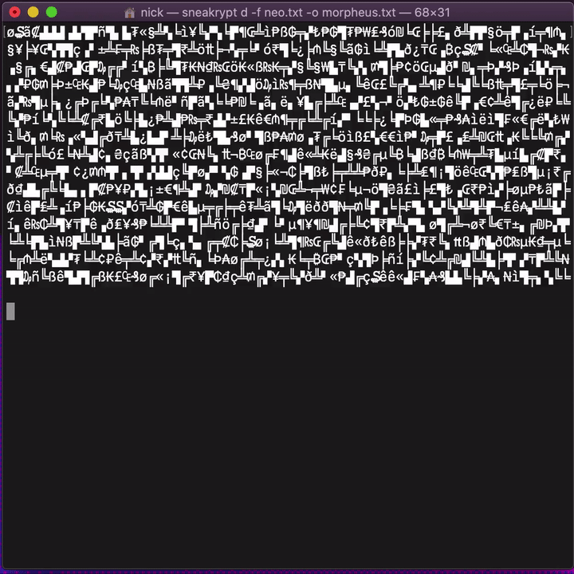

# ./sneakrypt
A simple CLI for synchronously encrypting and decrypting text files modeled on the classic hacker film [Sneakers](https://www.youtube.com/watch?v=F5bAa6gFvLs), because there's no technical reason hacking can't look the way it does in the movies.



yes, this was just for fun<br>
yes, it actually works<br>
u can [download binaries](https://github.com/nbriz/sneakrypt/releases/tag/1.0) for Linux, MacOS and Windows<br>
or u can download the source code here
```
git clone https://github.com/nbriz/sneakrypt.git; cd sneakrypt; npm install
```

here's the hlpe file:
```
Commands:
  e, encrypt       encrypt a message or text file
  d, decrypt       decrypt a message or text file

Options:
  -h              display this help file
  -m              message to encrypt or decrypt
  -f              path to file to encrypt or decrypt
  -o              path to save the output file

Examples:
  sneakrypt encrypt -m "hello world"
  sneakrypt encrypt -f ~/Desktop/message.txt
  sneakrypt encrypt -m "hello world" -o ~/Desktop/encrypted.txt
  sneakrypt decrypt -f ~/Desktop/encrypted.txt
```
